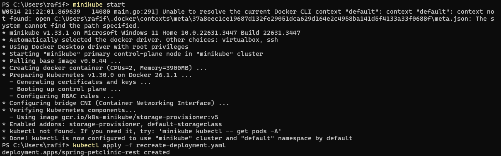

# Tutorial 11

## Reflection - Hello Minikube

#### 1. Compare the application logs before and after you exposed it as a Service. Try to open the app several times while the proxy into the Service is running. What do you see in the logs? Does the number of logs increase each time you open the app?

Once the deployment is set up as a service, it becomes accessible externally, enabling connections from outside sources. Consequently, accessing the provided service URL will lead to a surge in log entries due to the influx of incoming HTTP requests.
 
#### 2. Notice that there are two versions of `kubectl get` invocation during this tutorial section. The first does not have any option, while the latter has `-n` option with value set to `kube-system`. What is the purpose of the `-n` option and why did the output not list the pods/services that you explicitly created?

The `-n` option is used to specify the namespace to list the resources from. The output did not list the pods/services that I explicitly created because the pods/services were created in the default namespace and not in the `kube-system` namespace.

## Reflection - Rolling updates & Kubernetes Manifest File

#### 1.  What is the difference between Rolling Update and Recreate deployment strategy?

Rolling Update is a deployment strategy that updates the pods in a rolling fashion, one by one, to ensure that the application remains available during the update process. On the other hand, Recreate deployment strategy terminates all the existing pods before creating new ones, which results in a downtime during the update process.

#### 2. Try deploying the Spring Petclinic REST using Recreate deployment strategy and document your attempt.

#### 3. Prepare different manifest files for executing Recreate deployment strategy.

The file can be seen on the repository with the name `recreate-deployment.yaml`.

#### 4. What do you think are the benefits of using Kubernetes manifest files? Recall your experience in deploying the app manually and compare it to your experience when deploying the same app by applying the manifest files (i.e., invoking `kubectl apply-f` command) to the cluster.

Kubernetes manifest files provide a declarative way to define the desired state of the application, which can be version controlled and shared with others. This makes it easier to manage the application lifecycle and scale the application as needed. In contrast, deploying the app manually requires manual intervention and is error-prone, especially when deploying the app to multiple environments.